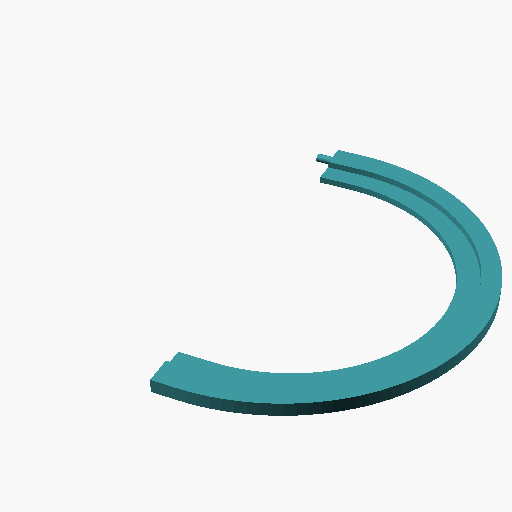

# earpad-adapter

Parametric 3D-printable adapter ring that lets you fit larger replacement earpads onto a headset with a smaller mount oval.

**[Open the configurator →](https://thefehr.github.io/earpad-adapter/)**

## What it does

Many headsets (e.g. Steelseries Arctis Pro) have a smaller mount oval than the inner opening of aftermarket replacement earpads. This adapter bridges that gap: it sits in the headset's mount groove on the inside and holds the replacement earpad on the outside.

The adapter prints as two half-rings that clip together around the headset cup. No glue or hardware needed.

## How to use

1. Measure your headset mount oval (the raised rim the earpad clips onto) and your replacement earpad's inner opening.
2. Open the configurator and enter your measurements.
3. Switch to **Assembly** view to see both halves and verify the dimension labels match.
4. Click **Download STL** and print two copies of the half.

## Parameters

| Parameter | Description |
|---|---|
| `mount_major` | Headset mount oval — long axis (top/bottom) |
| `mount_minor` | Headset mount oval — short axis (left/right, = end-circle diameter) |
| `pad_major` | Replacement earpad inner opening — long axis |
| `pad_minor` | Replacement earpad inner opening — short axis |
| `adapter_h` | Total ring height |
| `fit_clearance` | Extra clearance added to the bore so the ring slides onto the mount (0.2 mm per side is typical) |
| `ridge_w` | Axial width of the inner ridge that sits in the mount's retaining groove |
| `ridge_d` | Radial depth of that ridge |
| `groove_w` | Width of an optional outer grommet groove (0 = disabled) |
| `groove_d` | Depth of that grommet groove |

## Print settings

- Material: PETG or TPU for some flex, PLA works too
- Layer height: 0.2 mm
- Infill: 20 % or more
- No supports needed

## License

[CC BY 4.0](https://creativecommons.org/licenses/by/4.0/)
